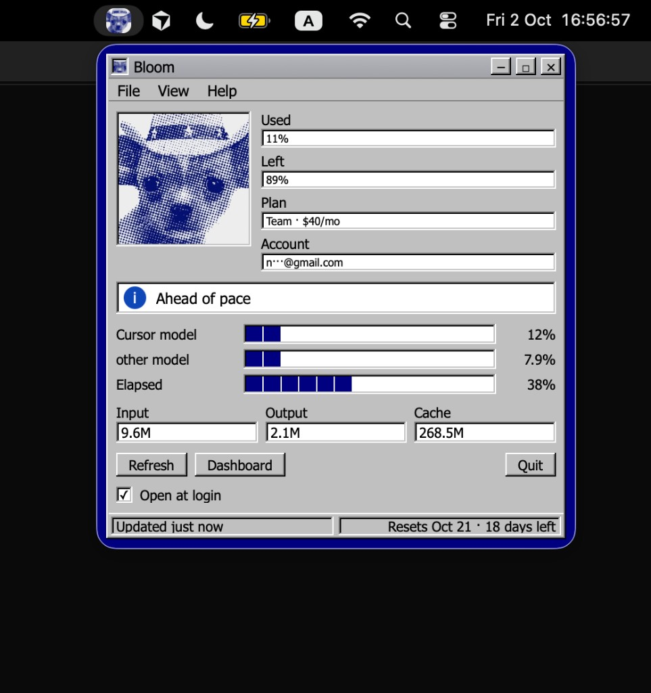
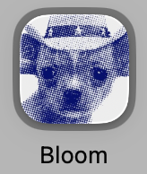

# Bloom

Bloom is a macOS menu bar app that shows Cursor usage for the account already signed in on that Mac. It does not ask for an API key.





## Build

You need macOS 15 or later, [Cursor](https://cursor.com) installed and signed in, and the Swift command-line tools (`xcode-select --install`).

```zsh
git clone https://github.com/n6teen/cursor-bloom.git
cd cursor-bloom
./scripts/build-app.sh
open ~/Applications/Bloom.app
```

Bloom appears in the menu bar, not the Dock. The first time you open the panel it reads Cursor’s local session on your Mac and loads the current billing cycle.
